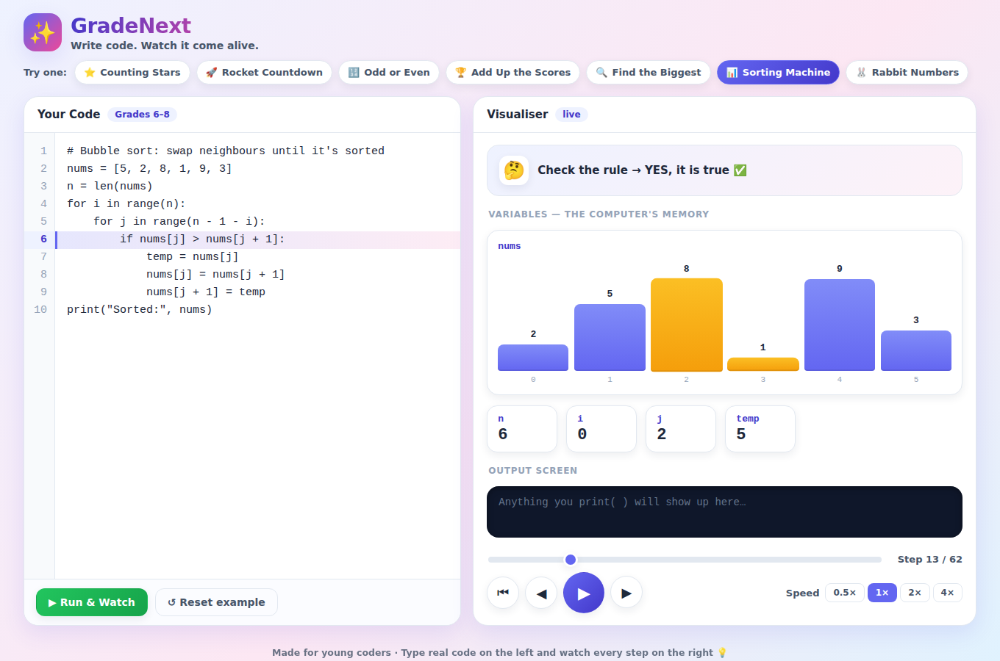

# ✨ GradeNext — Watch Your Code Come Alive

A coding platform for **young learners (grades 2–8)**. Students type real code on
one side and watch it run — step by step, like a video — on the other. Variables
appear as memory boxes, lists animate as bars (great for sorting!), loops and
`if`-checks are narrated in plain, friendly language, and `print(...)` output
shows up on a little screen.

The goal is simple: help a child's brain *see* how code works, not just read it.



## Why this exists

Beginners can copy code without understanding what happens inside the computer.
GradeNext turns each line into an animated, narrated step you can **play, pause,
rewind, and scrub** — turning an abstract idea into something you can watch.

## Features

- 🎬 **Video-style playback** — play / pause / step / restart, a scrubber, and
  0.5×–4× speeds. Every step is one "frame" of the program.
- 📦 **Live memory** — every variable is shown as a box that pops when it changes.
- 📊 **Animated lists** — number lists render as bars; cells being **compared**
  glow amber and cells being **written** glow green. Bubble sort looks magical.
- 🖨️ **Output screen** — `print(...)` lines appear one by one.
- 🗣️ **Kid-friendly narration** — each step says what just happened
  ("Set total = 35", "Check the rule → YES ✅", "Loop: i = 3").
- 🧒 **Friendly errors** — plain-English messages with the line number, and it
  can never freeze the browser (steps and loops are capped).
- 🎈 **Seven built-in examples** from counting stars to a sorting machine.

## The mini-language

A small, safe subset of Python chosen so it stays approachable:

- Variables & math: `x = 3 + 4 * 2`
- Text: `name = "Sam"`, `print("Hi", name)`
- Lists & indexing: `nums = [5, 2, 8]`, `nums[0] = 9`, `len(nums)`, `append(nums, 4)`
- Decisions: `if / elif / else` with `and`, `or`, `not`
- Loops: `for i in range(5):`, `for item in list:`, `while count > 0:`
- Helpers: `range`, `len`, `append`, `int`, `abs`, `sum`, `min`, `max`
- `break` and `continue`

Blocks use indentation, just like Python.

## Run it locally

```bash
npm install
npm run dev      # open the printed http://localhost:5173 URL
```

Other scripts:

```bash
npm run build    # type-check + production build into dist/
npm run preview  # preview the production build
```

Requires Node 18+.

## How it works

```
src/
  lang/
    tokenizer.ts     # text  -> tokens (one line at a time)
    parser.ts        # tokens -> AST (indentation-based, recursive descent)
    interpreter.ts   # AST   -> an array of "frames" (state snapshots)
    examples.ts      # the built-in sample programs
    types.ts         # shared types (Frame, Value, ...)
  components/
    CodeEditor.tsx   # textarea + highlight strip for the running line
    Stage.tsx        # the "movie screen": narration + variables + console
    VariablesPanel.tsx / ArrayViz.tsx / Console.tsx
    Player.tsx       # the video-style transport controls
  App.tsx            # ties code -> frames -> playback together
```

The interpreter runs the whole program up front and records a **frame** after
every small step (each frame is a full snapshot: the current line, all
variables, output so far, a narration note, and which list cells were touched).
The UI then just plays those frames like a flip-book — which is what makes
scrubbing, stepping, and speed changes instant.

## Ideas for later

- Save & share a student's program via a link
- A drag-and-drop block mode for the youngest learners
- User-defined functions and simple turtle/drawing output
- Teacher dashboards and guided lessons

---

Built as a first working MVP. Contributions and classroom feedback welcome!
